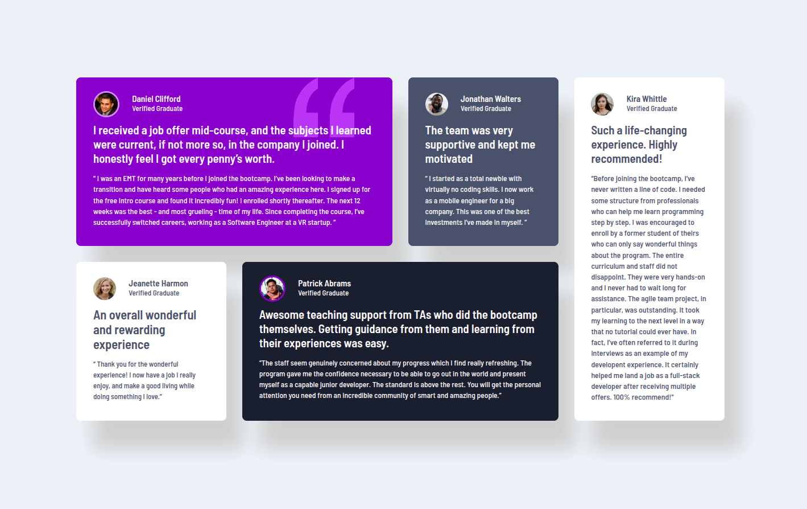

# Frontend Mentor - Testimonials grid section solution

This is a solution to the [Testimonials grid section challenge on Frontend Mentor](https://www.frontendmentor.io/challenges/testimonials-grid-section-Nnw6J7Un7). Frontend Mentor challenges help you improve your coding skills by building realistic projects. 

## Table of contents

- [Overview](#overview)
  - [The challenge](#the-challenge)
  - [Screenshot](#screenshot)
  - [Links](#links)
- [My process](#my-process)
  - [Built with](#built-with)
  - [What I learned](#what-i-learned)
  - [Continued development](#continued-development)
  - [Useful resources](#useful-resources)
  - [AI Collaboration](#ai-collaboration)
- [Author](#author)
- [Acknowledgments](#acknowledgments)

## Overview

### The challenge

Users should be able to:

- View the optimal layout for the site depending on their device's screen size

### Screenshots

<p align="center">
  
</p>

<p align="center">  
  
</p>

### Links

- Solution URL: https://github.com/chadgarc/testimonials-grid-section-main
- Live Site URL: https://chadgarc.github.io/testimonials-grid-section-main/

## My process

### Built with

- Semantic HTML5 markup
```html
<main>, <section>, <article>, <header>
```
- CSS Grid for the main layout
- Flexbox for user info alignment
- Mobile-first workflow
- CSS custom properties (HSL colors)
- Basic accessibility practices (alt text, semantic structure)

### What I learned

This project helped me strengthen several core front-end concepts:

# Semantic HTML

I replaced generic ```<div>``` elements with meaningful tags like ```<article>``` and ```<header>```. This improves accessibility and makes the structure easier to understand.

# CSS Grid with template areas

I used ```grid-template-areas``` to precisely match the original design layout:

```css
grid-template-areas:
  "top-left top-left top-middle side-right"
  "bottom-left bottom-middle bottom-middle side-right";
```

This gave me full control over card placement.

# Responsive design

On smaller screens, I simplified the grid:

```css
@media (max-width: 800px) {
  .grid-container {
    grid-template-columns: 1fr;
    grid-template-areas: none;
  }
}
```

# Accessibility basics

-  Added descriptive alt attributes to images
-  Used semantic HTML to improve screen reader navigation
-  Verified color contrast (Frontend Mentor’s palette already meets WCAG standards)

### Continued development

-  In future projects, I want to keep improving:
-  More advanced accessibility (ARIA roles, keyboard navigation)
-  Scalable CSS architecture (BEM, utility-first)
-  Component-based development with frameworks
-  More complex responsive layouts

### Useful resources

-  MDN Web Docs – Great reference for HTML, CSS, and accessibility
-  WebAIM Contrast Checker – Helpful for validating color contrast
-  Frontend Mentor – Realistic challenges that improve layout and CSS skills

**Note: Delete this note and replace the list above with resources that helped you during the challenge. These could come in handy for anyone viewing your solution or for yourself when you look back on this project in the future.**

### AI Collaboration

I used AI tools (such as Copilot) to:

-  Review semantic HTML structure
-  Improve accessibility
-  Clean up the README
-  Clarify CSS Grid and Flexbox concepts

What worked well:

- Fast explanations and code reviews
- Helpful guidance on semantic markup and accessibility

What didn’t:

-  Some suggestions were more advanced than needed for this challenge, so I simplified them.

## Author

- Christian Garlen, GH: https://github.com/chadgarc
- Frontend Mentor: @chadgarc

## Acknowledgments

Thanks to the Frontend Mentor community for inspiration and references, and to AI assistance for helping refine the structure and accessibility of the project.